Sure, let's create a SysML class diagram in Mermaid syntax for the coffee machine based on the provided requirements.

```mermaid
classDiagram
    %% Define the main CoffeeMachine block
    class CoffeeMachine {
        +ID: int
        +Description: "A complex mechatronic device to prepare different coffee types"
    }

    %% Define the Component block
    class Component {
        +ID: int
        +Description: String
    }

    %% Define the ControlModule block
    class ControlModule {
        +ID: int
        +Description: "Module to control the coffee machine"
    }

    %% Define the InteractiveElements block
    class InteractiveElements {
        +ID: int
        +Description: "Elements to simulate real usage"
    }

    %% Define the libraries
    class SignalAndControl {
        +ID: int
        +Description: "Library for signal and control"
    }

    class OneDMechanical {
        +ID: int
        +Description: "Library for 1D mechanical components"
    }

    class Thermal {
        +ID: int
        +Description: "Library for thermal components"
    }

    class ThermalHydraulic {
        +ID: int
        +Description: "Library for thermal hydraulic components"
    }

    class TwoPhaseFlow {
        +ID: int
        +Description: "Library for two-phase flow components"
    }

    class ElectricalBasics {
        +ID: int
        +Description: "Library for basic electrical components"
    }

    class ElectricalMotorsAndDrives {
        +ID: int
        +Description: "Library for electrical motors and drives"
    }

    %% Define relationships
    CoffeeMachine --> Component : contains
    CoffeeMachine --> ControlModule : contains
    CoffeeMachine --> InteractiveElements : contains

    CoffeeMachine --> SignalAndControl : uses
    CoffeeMachine --> OneDMechanical : uses
    CoffeeMachine --> Thermal : uses
    CoffeeMachine --> ThermalHydraulic : uses
    CoffeeMachine --> TwoPhaseFlow : uses
    CoffeeMachine --> ElectricalBasics : uses
    CoffeeMachine --> ElectricalMotorsAndDrives : uses
```

This diagram represents the hierarchical structure of the coffee machine and its components, as well as the libraries used in the modeling process. Each block has an ID and a description, and the relationships between the blocks are clearly defined.