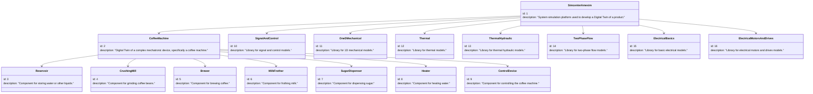

```mermaid
classDiagram
    %% Top-level block
    class SimcenterAmesim {
        id: 1
        description: "System simulation platform used to develop a Digital Twin of a product."
    }

    %% Coffee Machine block
    class CoffeeMachine {
        id: 2
        description: "Digital Twin of a complex mechatronic device, specifically a coffee machine."
    }

    %% Component blocks
    class Reservoir {
        id: 3
        description: "Component for storing water or other liquids."
    }

    class CrushingMill {
        id: 4
        description: "Component for grinding coffee beans."
    }

    class Brewer {
        id: 5
        description: "Component for brewing coffee."
    }

    class MilkFrother {
        id: 6
        description: "Component for frothing milk."
    }

    class SugarDispenser {
        id: 7
        description: "Component for dispensing sugar."
    }

    class Heater {
        id: 8
        description: "Component for heating water."
    }

    class ControlDevice {
        id: 9
        description: "Component for controlling the coffee machine."
    }

    %% Library blocks
    class SignalAndControl {
        id: 10
        description: "Library for signal and control models."
    }

    class OneDMechanical {
        id: 11
        description: "Library for 1D mechanical models."
    }

    class Thermal {
        id: 12
        description: "Library for thermal models."
    }

    class ThermalHydraulic {
        id: 13
        description: "Library for thermal hydraulic models."
    }

    class TwoPhaseFlow {
        id: 14
        description: "Library for two-phase flow models."
    }

    class ElectricalBasics {
        id: 15
        description: "Library for basic electrical models."
    }

    class ElectricalMotorsAndDrives {
        id: 16
        description: "Library for electrical motors and drives models."
    }

    %% Containment relationships
    SimcenterAmesim --> CoffeeMachine
    CoffeeMachine --> Reservoir
    CoffeeMachine --> CrushingMill
    CoffeeMachine --> Brewer
    CoffeeMachine --> MilkFrother
    CoffeeMachine --> SugarDispenser
    CoffeeMachine --> Heater
    CoffeeMachine --> ControlDevice

    SimcenterAmesim --> SignalAndControl
    SimcenterAmesim --> OneDMechanical
    SimcenterAmesim --> Thermal
    SimcenterAmesim --> ThermalHydraulic
    SimcenterAmesim --> TwoPhaseFlow
    SimcenterAmesim --> ElectricalBasics
    SimcenterAmesim --> ElectricalMotorsAndDrives
```