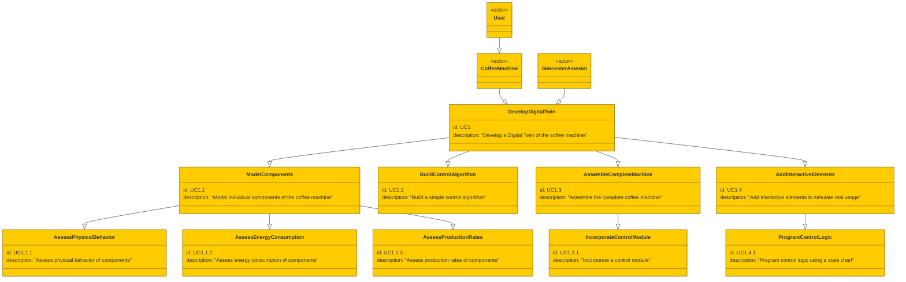

To create a SysML Use Case Diagram in Mermaid based on the provided requirements, we need to identify the use cases for the coffee machine and structure them hierarchically. Here is the Mermaid code for the Use Case Diagram:

This diagram includes the main use cases for developing a Digital Twin of a coffee machine using Simcenter Amesim, with hierarchical containment relationships and descriptions for each use case. The actors involved are the User and Simcenter Amesim.