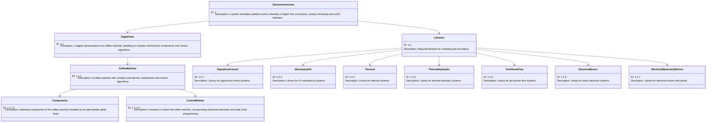

```mermaid
classDiagram
    %% Top-level block
    class SimcenterAmesim {
        ID: 1
        Description: A system simulation platform used to develop a Digital Twin of products, closely mimicking real-world behavior.
    }

    %% Sub-blocks
    class DigitalTwin {
        ID: 1.1
        Description: A digital representation of a coffee machine, detailing its complex mechatronic components and control algorithms.
    }

    class CoffeeMachine {
        ID: 1.1.1
        Description: A coffee machine with complex mechatronic components and control algorithms.
    }

    class Components {
        ID: 1.1.1.1
        Description: Individual components of the coffee machine modeled at an intermediate detail level.
    }

    class ControlModule {
        ID: 1.1.1.2
        Description: A module to control the coffee machine, incorporating interactive elements and state chart programming.
    }

    %% Libraries
    class Libraries {
        ID: 1.2
        Description: Required libraries for modeling and simulation.
    }

    class SignalAndControl {
        ID: 1.2.1
        Description: Library for signal and control systems.
    }

    class Mechanical1D {
        ID: 1.2.2
        Description: Library for 1D mechanical systems.
    }

    class Thermal {
        ID: 1.2.3
        Description: Library for thermal systems.
    }

    class ThermalHydraulic {
        ID: 1.2.4
        Description: Library for thermal hydraulic systems.
    }

    class TwoPhaseFlow {
        ID: 1.2.5
        Description: Library for two-phase flow systems.
    }

    class ElectricalBasics {
        ID: 1.2.6
        Description: Library for basic electrical systems.
    }

    class ElectricalMotorsAndDrives {
        ID: 1.2.7
        Description: Library for electrical motors and drives.
    }

    %% Relationships
    SimcenterAmesim --> DigitalTwin
    DigitalTwin --> CoffeeMachine
    CoffeeMachine --> Components
    CoffeeMachine --> ControlModule
    SimcenterAmesim --> Libraries
    Libraries --> SignalAndControl
    Libraries --> Mechanical1D
    Libraries --> Thermal
    Libraries --> ThermalHydraulic
    Libraries --> TwoPhaseFlow
    Libraries --> ElectricalBasics
    Libraries --> ElectricalMotorsAndDrives
```