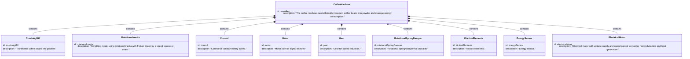

```mermaid
classDiagram
    %% Main Block
    class CoffeeMachine {
        id: mainReq
        description: "The coffee machine must efficiently transform coffee beans into powder and manage energy consumption."
    }

    %% Sub-blocks
    class CrushingMill {
        id: crushingMill
        description: "Transforms coffee beans into powder."
    }

    class RotationalInertia {
        id: rotationalInertia
        description: "Simplified model using rotational inertia with friction driven by a speed source or motor."
    }

    class Control {
        id: control
        description: "Control for constant rotary speed."
    }

    class Motor {
        id: motor
        description: "Motor icon for signal transfer."
    }

    class Gear {
        id: gear
        description: "Gear for speed reduction."
    }

    class RotationalSpringDamper {
        id: rotationalSpringDamper
        description: "Rotational spring/damper for causality."
    }

    class FrictionElements {
        id: frictionElements
        description: "Friction elements."
    }

    class EnergySensor {
        id: energySensor
        description: "Energy sensor."
    }

    class ElectricalMotor {
        id: electricalMotor
        description: "Electrical motor with voltage supply and speed control to monitor motor dynamics and heat generation."
    }

    %% Containment Relationships
    CoffeeMachine *-- CrushingMill : contains
    CoffeeMachine *-- RotationalInertia : contains
    CoffeeMachine *-- Control : contains
    CoffeeMachine *-- Motor : contains
    CoffeeMachine *-- Gear : contains
    CoffeeMachine *-- RotationalSpringDamper : contains
    CoffeeMachine *-- FrictionElements : contains
    CoffeeMachine *-- EnergySensor : contains
    CoffeeMachine *-- ElectricalMotor : contains
```